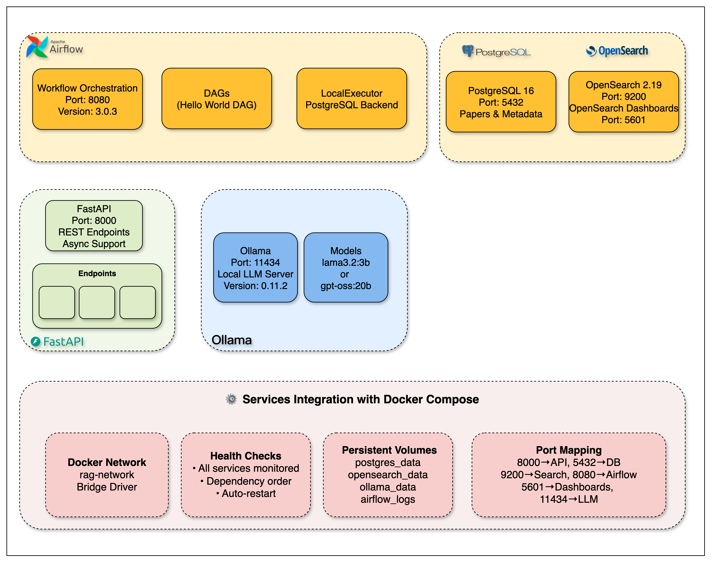

# Infrastructure setup

Guides for bringing up and verifying the Research Agent Docker stack.

## Contents

### `infrastructure_setup.ipynb`

Interactive checklist for:

1. **Prerequisites** — Docker, Python, UV, disk/RAM checks  
2. **Architecture** — how API, Postgres, OpenSearch, Airflow, and Ollama connect  
3. **Service verification** — health checks and smoke tests  
4. **Ollama** — optional model pull and generate tests  

<p align="center">
  
</p>

**Services**

| Service | Port | Role |
|---------|------|------|
| FastAPI | 8000 | REST API |
| PostgreSQL 16 | 5432 | Paper metadata |
| OpenSearch 2.19 | 9200 / 5601 | Search + dashboards |
| Apache Airflow | 8080 | Workflow orchestration |
| Ollama | 11434 | Local LLM |

## Ollama (optional)

```bash
make ollama-pull MODEL=llama3.2:1b
make ollama-test MODEL=llama3.2:1b
```

Or:

```bash
curl -X POST http://localhost:11434/api/pull -d '{"name":"llama3.2:1b"}'
curl -X POST http://localhost:11434/api/generate -d '{"model":"llama3.2:1b","prompt":"Hello","stream":false}'
```

Suggested models: `llama3.2:1b`, `llama3.2:3b`, `llama3.1:8b`. Models are not required for basic service health checks.

## Troubleshooting

1. Check notebook troubleshooting cells  
2. Confirm Docker has enough memory (8GB+)  
3. Run `make health` / `docker compose ps`  
4. Inspect logs: `docker compose logs -f [service]`  
